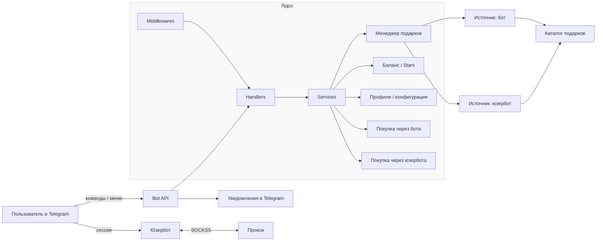
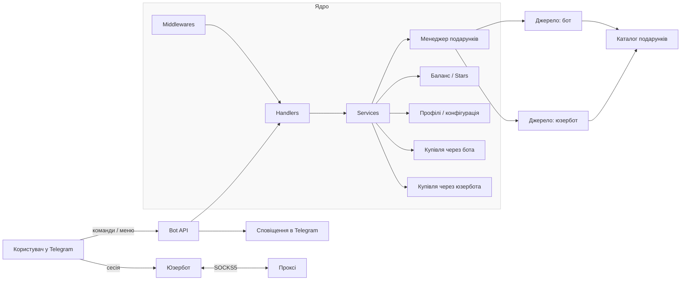
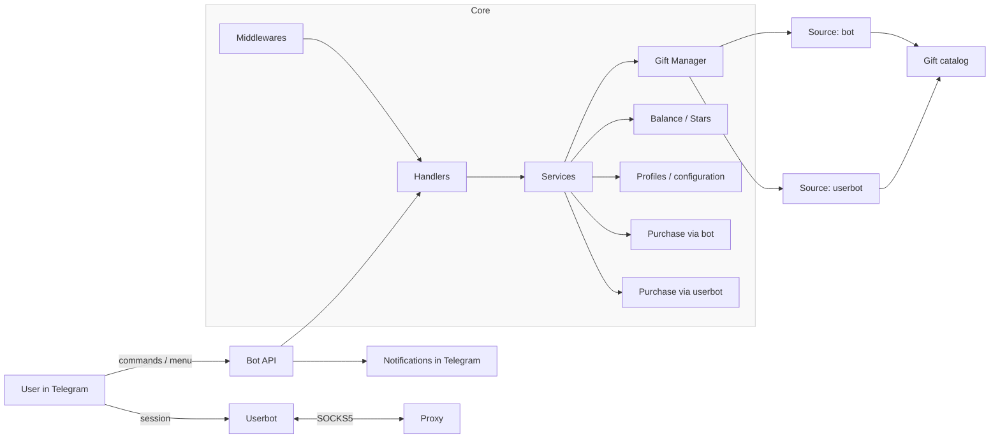

# 🥷 giftninja

[](assets/cover.PNG)

[Русский](#русский) | [Українська](#українська) | [English](#english)

### Русский

Инструмент для автоматизированной покупки подарков из маркетплейса в Telegram. Работает как через классического бота, так и через подключаемую сессию Telegram‑аккаунта (юзербот). Поддерживает профили, фильтры и полную автоматизацию. Комиссии отсутствуют. Исходники открыты.

---

## 📦 Что умеет бот

- Покупка по настраиваемым фильтрам: минимальная и максимальная цена, саплай и предел количества покупок.
- Два режима работы: от имени бота и через собственный аккаунт (юзербот) — можно подключить свою Telegram‑сессию и покупать напрямую.
- Поддержка SOCKS5‑прокси для юзербота и aiohttp‑сессии.
- Параллельный сбор списка подарков с двух источников (бот + юзербот) с выбором наиболее выгодного актуального варианта.
- До 3 независимых профилей с разными получателями и лимитами.
- Уведомления о выполненных покупках и завершении задач.
- Управление через интерактивное Telegram‑меню.
- Счётчик покупок и автостоп при достижении лимита.
- Пополнение и возврат через Telegram Stars, в том числе пополнение с любых аккаунтов.
- Тестовый сценарий — покупка подарка за 15 звёзд.
- Каталог подарков и покупка конкретного подарка в заданном количестве.
- Возврат всех звёзд одной командой.

---

## 🚀 Быстрый старт

1) Клонируйте репозиторий:
```bash
git clone https://github.com/zerox9dev/giftninja.git
cd giftninja
```

2) Установите зависимости:
```bash
pip install -r requirements.txt
```

3) Создайте файл `.env` в корне проекта — здесь хранятся переменные окружения.

Пример:
```env
TELEGRAM_BOT_TOKEN="123456:abcdefghijklmnopqrstuvwxyz"
TELEGRAM_USER_ID="123456789"
```

- `TELEGRAM_BOT_TOKEN` — токен бота из [@BotFather](https://t.me/BotFather)
- `TELEGRAM_USER_ID` — ваш user ID (можно узнать в [@userinfobot](https://t.me/userinfobot))

4) Запустите бота:
```bash
python main.py
```

---

## 🗺️ Схема работы



---

## 📂 Структура проекта

- `main.py` — точка входа приложения.
- `requirements.txt` — список зависимостей.
- `.env` — переменные окружения (не коммитится).
- `config.json` — пользовательская конфигурация (не коммитится).
- `handlers/` — обработчики апдейтов (`handlers_main.py`, `handlers_wizard.py` и др.).
- `middlewares/` — промежуточные обработчики (контроль доступа, логирование и т. п.).
- `services/` — бизнес‑логика и операции с подарками (`balance.py`, `buy_bot.py`, `buy_userbot.py`, `config.py`, `menu.py`, `gifts_*`).
- `utils/` — вспомогательные утилиты (`logging.py`, `misc.py`, `mockdata.py`, `proxy.py`).

---

## 🛠 Для разработчиков

- `handlers/` — добавляйте новые сценарии отдельными файлами.
- Логика вынесена в `services/` для переиспользования и тестирования.
- В `utils/` — изолированные вспомогательные функции.
- В `middlewares/` — настраиваемые промежуточные слои (например, контроль доступа, rate‑limit, логирование).


---

## 🧑‍💻 Поддержка

- Telegram: [@zerox9dev](https://t.me/zerox9dev)

---

## 📜 Лицензия

Проект распространяется под лицензией MIT. Благодарность [@leozizu](https://github.com/leozizu) за идею и основу проекта

---

### Українська

Інструмент для автоматизованої купівлі подарунків з маркетплейса в Telegram. Працює як через класичного бота, так і через підключену сесію Telegram‑акаунта (юзербот). Підтримує профілі, фільтри та повну автоматизацію. Комісії відсутні. Вихідний код відкритий.

---

## 📦 Можливості

- Купівля за налаштовуваними фільтрами: мінімальна і максимальна ціна, саплай та ліміт кількості покупок.
- Два режими роботи: від імені бота та через власний акаунт (юзербот) — можна підключити свою Telegram‑сесію і купувати напряму.
- Підтримка SOCKS5‑проксі для юзербота та aiohttp‑сесії.
- Паралельне збирання списку подарунків з двох джерел (бот + юзербот) з вибором найбільш вигідного актуального варіанту.
- До 3 незалежних профілів з різними одержувачами та лімітами.
- Сповіщення про виконані покупки та завершення задач.
- Керування через інтерактивне Telegram‑меню.
- Лічильник покупок та автостоп при досягненні ліміту.
- Поповнення та повернення через Telegram Stars, зокрема поповнення з будь‑яких акаунтів.
- Тестовий сценарій — купівля подарунка за 15 зірок.
- Каталог подарунків і купівля конкретного подарунка у заданій кількості.
- Повернення всіх зірок однією командою.

---

## 🚀 Швидкий старт

1) Клонуйте репозиторій:
```bash
git clone https://github.com/zerox9dev/giftninja.git
cd giftninja
```

2) Встановіть залежності:
```bash
pip install -r requirements.txt
```

3) Створіть файл `.env` у корені проєкту — тут зберігаються змінні середовища.

Приклад:
```env
TELEGRAM_BOT_TOKEN="123456:abcdefghijklmnopqrstuvwxyz"
TELEGRAM_USER_ID="123456789"
```

- `TELEGRAM_BOT_TOKEN` — токен бота з [@BotFather](https://t.me/BotFather)
- `TELEGRAM_USER_ID` — ваш user ID (можна дізнатись у [@userinfobot](https://t.me/userinfobot))

4) Запустіть бота:
```bash
python main.py
```

---

## 🗺️ Схема роботи



---

## 📂 Структура проєкту

- `main.py` — точка входу застосунку.
- `requirements.txt` — список залежностей.
- `.env` — змінні середовища (не комітиться).
- `config.json` — користувацька конфігурація (не комітиться).
- `handlers/` — обробники оновлень (`handlers_main.py`, `handlers_wizard.py` тощо).
- `middlewares/` — проміжні обробники (контроль доступу, логування тощо).
- `services/` — бізнес‑логіка та операції з подарунками (`balance.py`, `buy_bot.py`, `buy_userbot.py`, `config.py`, `menu.py`, `gifts_*`).
- `utils/` — допоміжні утиліти (`logging.py`, `misc.py`, `mockdata.py`, `proxy.py`).

---

## 🛠 Для розробників

- Додавайте нові сценарії окремими файлами в `handlers/`.
- Логіку винесено до `services/` для повторного використання та тестування.
- В `utils/` — ізольовані допоміжні функції.
- В `middlewares/` — налаштовувані проміжні шари (наприклад, контроль доступу, rate‑limit, логування).

---

## 🧑‍💻 Підтримка

- Telegram: [@zerox9dev](https://t.me/zerox9dev)

---

## 📜 Ліцензія

Проєкт розповсюджується за ліцензією MIT. Подяка [@leozizu](https://github.com/leozizu) за ідею та основу проєкту.

---

### English

A tool for automated purchasing of gifts from a Telegram marketplace. Works via a classic bot and a pluggable Telegram account session (userbot). Supports profiles, filters, and full automation. No fees. Open source.

---

## 📦 Features

- Purchases with customizable filters: min/max price, supply, and purchase count cap.
- Two operation modes: bot and userbot — connect your own Telegram session and buy directly.
- SOCKS5 proxy support for the userbot and the aiohttp session.
- Parallel fetching of gift lists from two sources (bot + userbot) with selection of the most profitable current option.
- Up to 3 independent profiles with different recipients and limits.
- Notifications about completed purchases and task completion.
- Control via an interactive Telegram menu.
- Purchase counter and auto‑stop when the limit is reached.
- Top‑ups and refunds via Telegram Stars, including top‑ups from any accounts.
- Test scenario — purchase a gift for 15 stars.
- Gift catalog and purchasing a specific gift in a given quantity.
- Refund all stars with a single command.

---

## 🚀 Quick start

1) Clone the repository:
```bash
git clone https://github.com/zerox9dev/giftninja.git
cd giftninja
```

2) Install dependencies:
```bash
pip install -r requirements.txt
```

3) Create a `.env` file in the project root — this is where environment variables are stored.

Example:
```env
TELEGRAM_BOT_TOKEN="123456:abcdefghijklmnopqrstuvwxyz"
TELEGRAM_USER_ID="123456789"
```

- `TELEGRAM_BOT_TOKEN` — bot token from [@BotFather](https://t.me/BotFather)
- `TELEGRAM_USER_ID` — your user ID (you can get it from [@userinfobot](https://t.me/userinfobot))

4) Run the bot:
```bash
python main.py
```

---

## 🗺️ Architecture



---

## 📂 Project structure

- `main.py` — application entry point.
- `requirements.txt` — dependency list.
- `.env` — environment variables (not committed).
- `config.json` — user configuration (not committed).
- `handlers/` — update handlers (`handlers_main.py`, `handlers_wizard.py`, etc.).
- `middlewares/` — middleware layers (access control, logging, etc.).
- `services/` — business logic and gift operations (`balance.py`, `buy_bot.py`, `buy_userbot.py`, `config.py`, `menu.py`, `gifts_*`).
- `utils/` — helper utilities (`logging.py`, `misc.py`, `mockdata.py`, `proxy.py`).

---

## 🛠 For developers

- Add new scenarios in `handlers/` as separate files.
- Core logic is placed in `services/` for reuse and testing.
- `utils/` contains isolated helper functions.
- `middlewares/` provides configurable layers (e.g., access control, rate‑limit, logging).

---

## 🧑‍💻 Support

- Telegram: [@zerox9dev](https://t.me/zerox9dev)

---

## 📜 License

Distributed under the MIT License. Thanks to [@leozizu](https://github.com/leozizu) for the idea and the base project.
