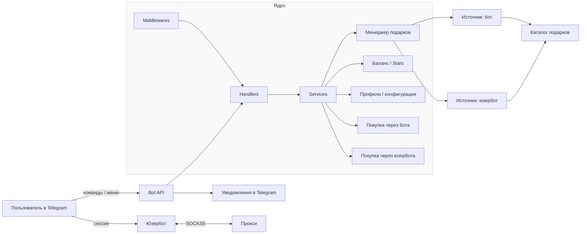

# 🥷 giftninja

Инструмент для автоматизированной покупки подарков из маркетплейса в Telegram. Работает как через классического бота, так и через подключаемую сессию Telegram‑аккаунта (юзербот). Поддерживает профили, фильтры и полную автоматизацию. Комиссии отсутствуют. Исходники открыты.

---

## 📦 Что умеет бот

- Покупка по настраиваемым фильтрам: минимальная и максимальная цена, саплай и предел количества покупок.
- Два режима работы: от имени бота и через собственный аккаунт (юзербот) — можно подключить свою Telegram‑сессию и покупать напрямую.
- Поддержка SOCKS5‑прокси для юзербота и aiohttp‑сессии.
- Параллельный сбор списка подарков с двух источников (бот + юзербот) с выбором наиболее выгодного актуального варианта.
- До 3 независимых профилей с разными получателями и лимитами.
- Уведомления о выполненных покупках и завершении задач.
- Управление через интерактивное Telegram‑меню.
- Счётчик покупок и автостоп при достижении лимита.
- Пополнение и возврат через Telegram Stars, в том числе пополнение с любых аккаунтов.
- Тестовый сценарий — покупка подарка за 15 звёзд.
- Каталог подарков и покупка конкретного подарка в заданном количестве.
- Возврат всех звёзд одной командой.

---

## 🚀 Быстрый старт

1) Клонируйте репозиторий:
```bash
git clone https://github.com/zerox9dev/giftninja.git
cd giftninja
```

2) Установите зависимости:
```bash
pip install -r requirements.txt
```

3) Создайте файл `.env` в корне проекта — здесь хранятся переменные окружения.

Пример:
```env
TELEGRAM_BOT_TOKEN="123456:abcdefghijklmnopqrstuvwxyz"
TELEGRAM_USER_ID="123456789"
```

- `TELEGRAM_BOT_TOKEN` — токен бота из [@BotFather](https://t.me/BotFather)
- `TELEGRAM_USER_ID` — ваш user ID (можно узнать в [@userinfobot](https://t.me/userinfobot))

4) Запустите бота:
```bash
python main.py
```

---

## 🗺️ Схема работы



---

## 📂 Структура проекта

- `main.py` — точка входа приложения.
- `requirements.txt` — список зависимостей.
- `.env` — переменные окружения (не коммитится).
- `config.json` — пользовательская конфигурация (не коммитится).
- `handlers/` — обработчики апдейтов (`handlers_main.py`, `handlers_wizard.py` и др.).
- `middlewares/` — промежуточные обработчики (контроль доступа, логирование и т. п.).
- `services/` — бизнес‑логика и операции с подарками (`balance.py`, `buy_bot.py`, `buy_userbot.py`, `config.py`, `menu.py`, `gifts_*`).
- `utils/` — вспомогательные утилиты (`logging.py`, `misc.py`, `mockdata.py`, `proxy.py`).

---

## 🛠 Для разработчиков

- `handlers/` — добавляйте новые сценарии отдельными файлами.
- Логика вынесена в `services/` для переиспользования и тестирования.
- В `utils/` — изолированные вспомогательные функции.
- В `middlewares/` — настраиваемые промежуточные слои (например, контроль доступа, rate‑limit, логирование).


---

## 🧑‍💻 Поддержка

- Telegram: [@zerox9dev](https://t.me/zerox9dev)

---

## 📜 Лицензия

Проект распространяется под лицензией MIT. Благодарность [@leozizu](https://github.com/leozizu) за идею и основу проекта
